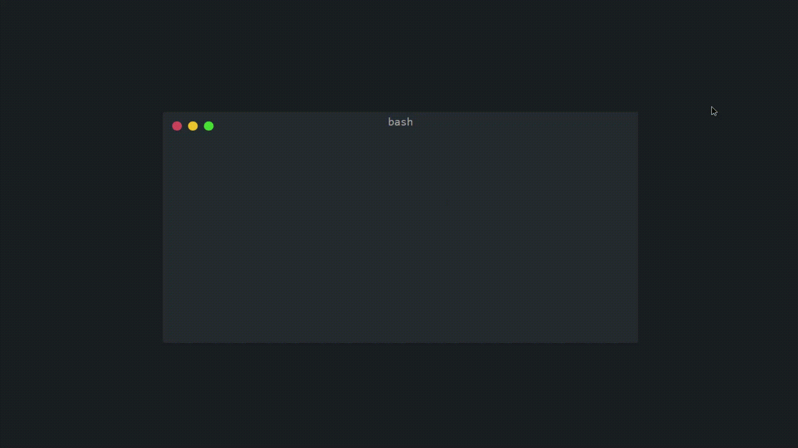

# FastAPI in 5 minutes

## Introduction:

### _From [FastAPI](https://fastapi.tiangolo.com/) website_

> FastAPI is a modern, fast (high-performance), web framework for building APIs with Python 3.6+ based on standard Python type hints.

## Installation:

### _Step 1:_ **Install fastapi using pip**

### _Step 2:_ **Install an ASGI server such as Uvicorn or Hypercorn.**

**_DONE!_**

